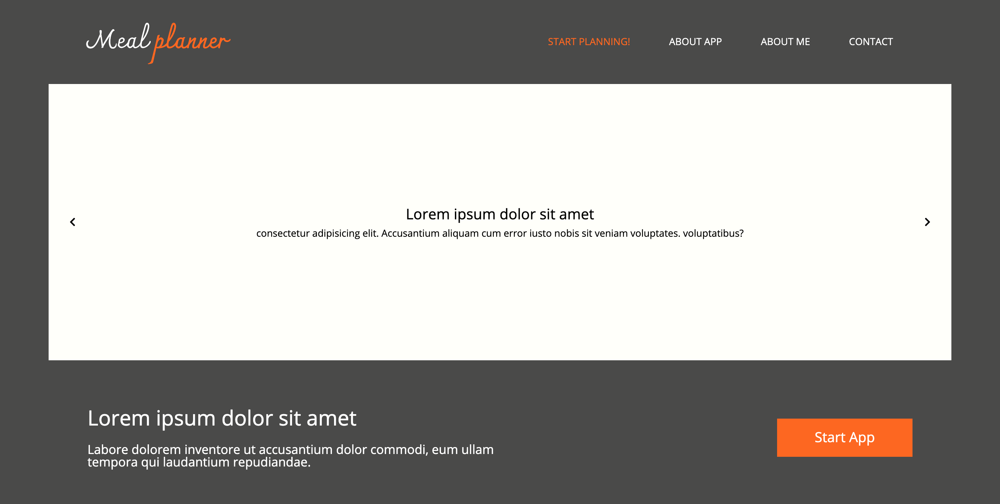
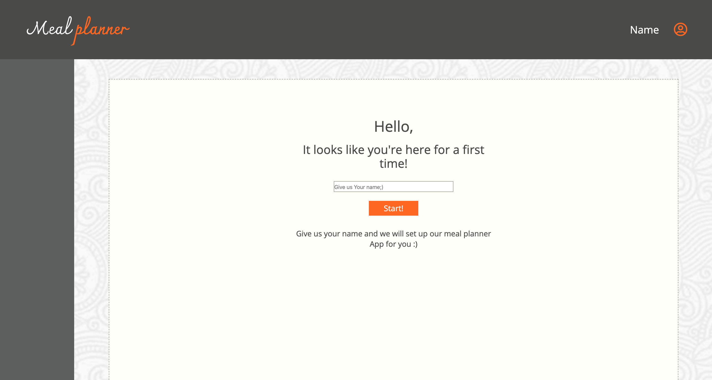
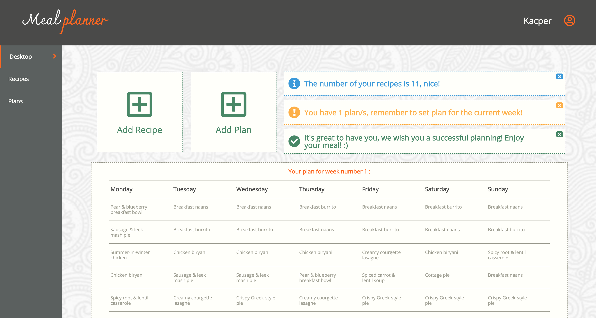
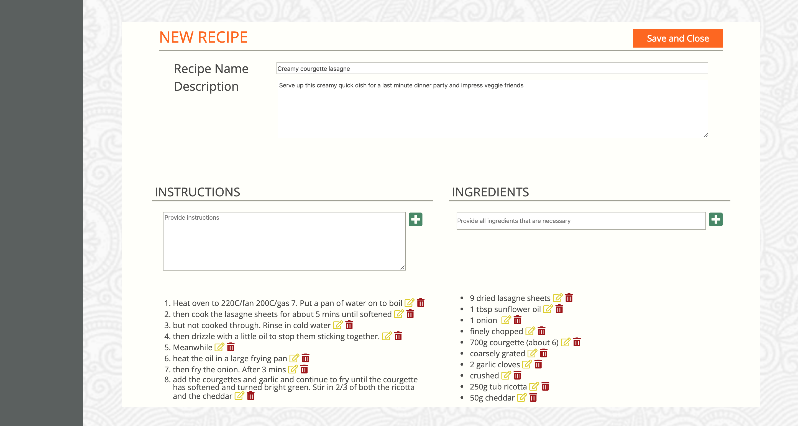
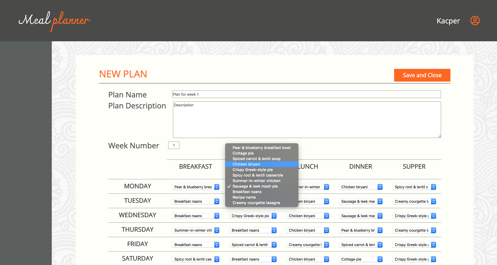
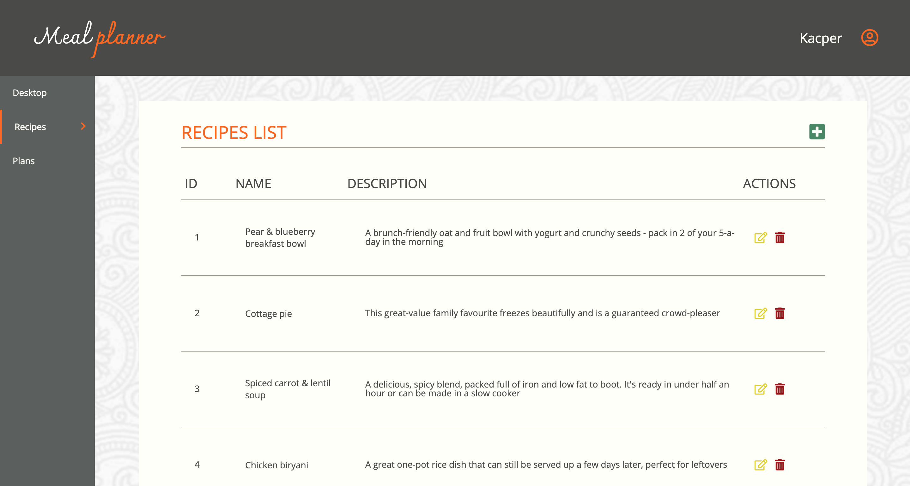
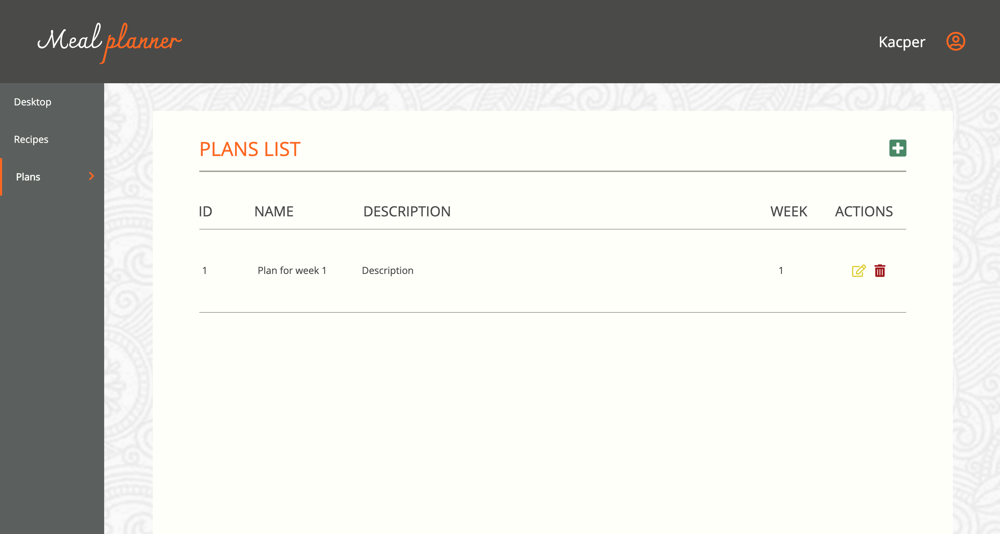

# Meal Planner App

## Description

Landing page and meal planner app. Application uses localStorage of your browser to store all the data. 

Meal planner App allows the user to: 

- Add recipes by providing name, description, instructions and ingredients
- Add meal plans based on recipes added
- Set and Display plan for current week
- Change between plans
- Display all recipes/plans
- Edit/Remove any plan or recipe
- See how many recipes and plans is currently being stored

## Used

- HTML
- SASS
- JavaScript
- jQuery
- Gulp

## Screen-shots

 

 

 

 

 

 

## Preview

Check the preview of the <b>APP</b> here: https://kacpermak1.github.io/Meal-planner-App/app.html  
Check the preview of the <b>WEBSITE</b> here: https://kacpermak1.github.io/Meal-planner-App/
